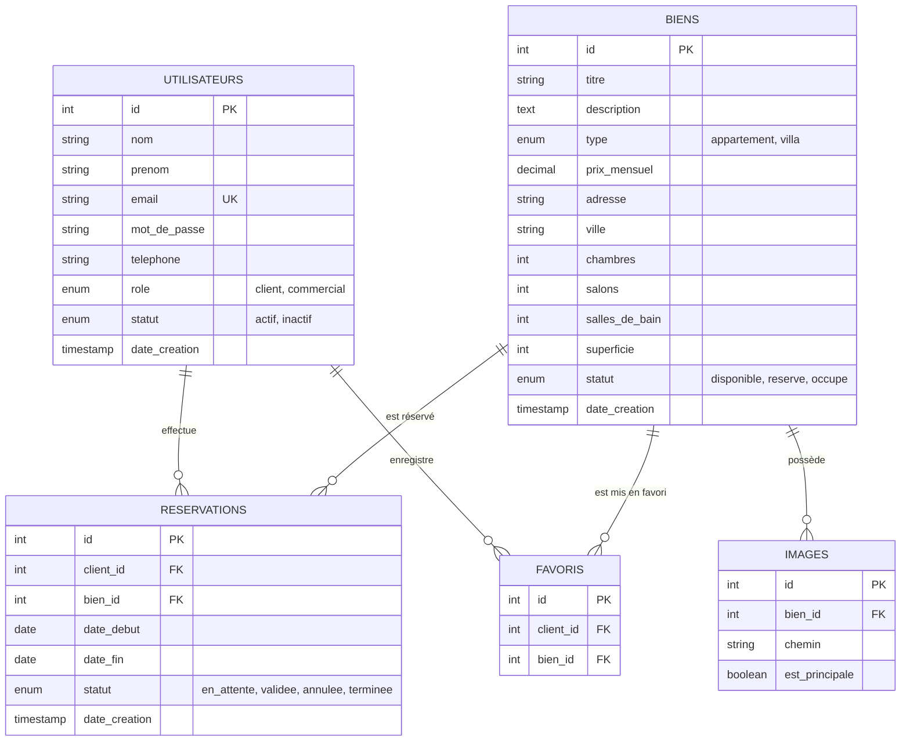

# Documentation Technique & Fonctionnelle — LuxeImmo

> **Projet** : Application Web de Gestion d'Agence Immobilière  
> **Module** : Développement Web Avancé  
> **Technologies** : PHP 8, MySQL, PDO, HTML5/CSS3, JavaScript Vanilla, Bootstrap 5.3  

---

## Table des Matières
1. [Présentation du Projet](#1-présentation-du-projet)
2. [Architecture Technique & Stack Software](#2-architecture-technique--stack-software)
3. [Arborescence du Projet](#3-arborescence-du-projet)
4. [Modèle de Données (Base MySQL)](#4-modèle-de-données-base-mysql)
5. [Périmètre Fonctionnel](#5-périmètre-fonctionnel)
   - [Espace Public](#51-espace-public)
   - [Espace Client](#52-espace-client)
   - [Espace Commercial (Administration)](#53-espace-commercial-administration)
6. [Sécurité et Architecture des Données](#6-sécurité-et-architecture-des-données)
7. [Guide des Comptes de Test](#7-guide-des-comptes-de-test)

---

## 1. Présentation du Projet

**LuxeImmo** est une solution web clé en main conçue pour une agence immobilière haut de gamme. Elle offre une expérience moderne et fluide tant pour les clients cherchant à louer/réserver des biens d'exception que pour l'équipe commerciale gérant le catalogue, les réservations et les clients.

### Objectifs Principaux :
- **Pour les visiteurs / clients** : Découvrir les biens immobiliers (villas, appartements), filtrer la recherche, enregistrer leurs coups de cœur en favoris, et effectuer des demandes de réservation directes.
- **Pour les commerciaux** : Disposer d'un tableau de bord de gestion (CRUD biens, gestion des images, suivi et validation des réservations, gestion des utilisateurs).

---

## 2. Architecture Technique & Stack Software

Le projet repose sur une architecture MVC simplifiée et modulaire sans framework lourd, garantissant performance et maîtrise du code :

- **Backend** : PHP 8+ (PDO avec gestion des transactions et requêtes préparées).
- **Base de données** : MySQL 8+ (Relationnelle avec contraintes d'intégrité et suppression en cascade `ON DELETE CASCADE`).
- **Frontend** : 
  - **HTML5 & CSS3 Custom** : Design System moderne avec Thème Sombre Premium, effets Glassmorphism, animations CSS et flexbox/grid.
  - **Bootstrap 5.3** : Composants UI & Responsive Design.
  - **JavaScript (ES6+)** : Interactivité UI, validation dynamique de formulaires, système de notifications Toast, et requêtes AJAX pour l'ajout/retrait dynamique des favoris sans rechargement de page.
- **Iconographie & Typographie** : Font Awesome 6 Pro, Google Fonts (*Plus Jakarta Sans*).

---

## 3. Arborescence du Projet

```text
Dev_Web_Avancé/
├── config/
│   └── db.php                  # Connexion centralisée PDO à MySQL
├── includes/
│   ├── header.php              # En-tête HTML, métadonnées & chargement des assets
│   ├── footer.php              # Pied de page commun et scripts JS
│   ├── navbar.php              # Barre de navigation dynamique (selon rôle connecté)
│   └── auth_check.php          # Middleware de sécurité et contrôle d'accès (RBAC)
├── assets/
│   ├── css/
│   │   └── style.css           # Design system custom (Variables CSS, Dark Theme)
│   ├── js/
│   │   └── main.js             # Logiciel JS client (AJAX favoris, Toasts, validations)
│   └── images/                 # Répertoire d'upload des images de biens
├── client/
│   ├── dashboard.php           # Tableau de bord client (suivi des réservations)
│   ├── favoris.php             # Liste des biens favoris enregistrés
│   ├── reserver.php            # Traitement de la réservation d'un bien
│   ├── annuler_reservation.php # Annulation d'une réservation client
│   └── toggle_favori.php       # API AJAX pour gérer les favoris
├── commercial/
│   ├── index.php               # Dashboard commercial (Statistiques KPI & métriques)
│   ├── biens.php               # CRUD complet des biens + Upload multiple d'images
│   ├── reservations.php        # Gestion et validation des réservations
│   ├── clients.php             # Gestion des comptes clients (Activer / Désactiver)
│   └── sidebar.php             # Menu latéral d'administration
├── index.php                   # Page d'accueil publique / Catalogue filtrable
├── detail.php                  # Fiche détaillée d'un bien (Galerie, équipements, réservation)
├── login.php                   # Page de connexion
├── register.php                # Formulaire d'inscription client
├── logout.php                  # Déconnexion et destruction de session
├── database.sql                # Script d'initialisation de la base de données SQL
├── DOCUMENTATION.md            # Documentation technique et fonctionnelle
└── GUIDE_RENDU.md              # Guide d'envoi et instructions de rendu au professeur
```

---

## 4. Modèle de Données (Base MySQL)

La base de données `agence_immo` est structurée autour de 5 tables relationnelles optimisées :



---

## 5. Périmètre Fonctionnel

### 5.1 Espace Public
- **Catalogue dynamique (`index.php`)** : Affichage des biens avec leur carte descriptive, prix mensuel, caractéristiques (chambres, salons, superficie) et badge de disponibilité.
- **Filtres de recherche avancés** : Filtrage simultané par type (Villa / Appartement), ville, tranche de prix et nombre de chambres.
- **Fiche détail (`detail.php`)** : Galerie photo interactive, caractéristiques complètes, coordonnées de l'agence et bloc d'action direct (Réserver / Ajouter aux favoris).

### 5.2 Espace Client
- **Création de compte & Authentification** : Inscription sécurisée avec contrôles JS/PHP et hachage du mot de passe.
- **Gestion des favoris (`favoris.php`)** : Ajout/suppression instantanée en AJAX via l'icône cœur sans rechargement de page.
- **Réservation en ligne (`reserver.php`)** : Choix des dates de début et de fin de séjour avec calcul automatique et vérification de la disponibilité.
- **Espace Personnel (`client/dashboard.php`)** : Visualisation des réservations en cours, validées ou annulées avec historique.

### 5.3 Espace Commercial (Administration)
- **Tableau de Bord KPI (`commercial/index.php`)** : Statistiques globales (Total biens, Réservations en attente, Revenus potentiels, Nombre de clients).
- **Gestion du Catalogue (`commercial/biens.php`)** :
  - Création de biens avec saisie de toutes les caractéristiques.
  - Upload multiple de photos d'illustration avec définition de l'image principale.
  - Édition et suppression de biens.
- **Gestion des Réservations (`commercial/reservations.php`)** : Validation ou annulation en un clic des demandes de réservation.
- **Gestion des Utilisateurs (`commercial/clients.php`)** : Liste des clients et possibilité d'activer ou désactiver un compte.

---

## 6. Sécurité et Architecture des Données

1. **Protection contre les Injections SQL** : Utilisation exclusive de requêtes préparées PDO (`prepare()`, `execute()`) pour toutes les requêtes SQL paramétrées.
2. **Sécurisation des Mots de Passe** : Hachage avec l'algorithme robuste BCRYPT via `password_hash()` et vérification avec `password_verify()`.
3. **Protection contre les Failles XSS** : Neutralisation des entités HTML sur tous les affichages utilisateurs via `htmlspecialchars()`.
4. **Contrôle d'Accès basé sur les Rôles (RBAC)** : Le composant `includes/auth_check.php` vérifie les variables de session (`$_SESSION['user_id']`, `$_SESSION['role']`) avant d'accorder l'accès aux pages réservées (Client / Commercial).
5. **Intégrité Référentielle BDD** : Les clés étrangères bénéficient de contraintes `ON DELETE CASCADE` garantissant la propreté de la base lors de la suppression d'un bien ou d'un utilisateur.

---

## 7. Guide des Comptes de Test

Pour évaluer l'application sans créer de compte, utilisez les identifiants préconfigurés ci-dessous (mots de passe déjà intégrés dans `database.sql`) :

| Rôle | Email | Mot de passe | Description de l'accès |
| :--- | :--- | :--- | :--- |
| **Commercial** | `commercial@immo.com` | `password123` | Accès complet au Dashboard administration, CRUD Biens, Validation des Réservations et Gestion Clients. |
| **Client 1** | `client@immo.com` | `password123` | Accès à l'Espace Client, Biens favoris et réservations effectuées. |
| **Client 2** | `client2@immo.com` | `password123` | Compte client secondaire pour tester des réservations concurrentes. |

---
*Document produit pour le rendu de Développement Web Avancé.*
